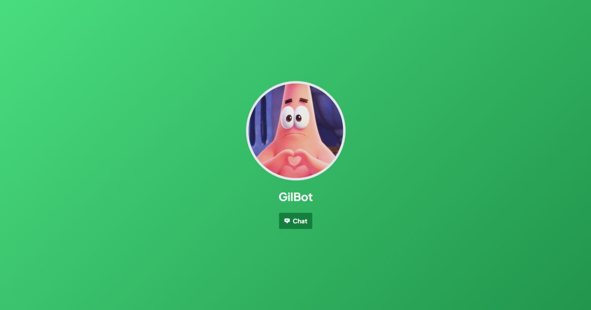

# GilBot Website



[](https://app.netlify.com/sites/gilbot/deploys)

This is a [Next.js](https://nextjs.org/) project bootstrapped with [`create-next-app`](https://github.com/vercel/next.js/tree/canary/packages/create-next-app).

## Getting Started

First, run the development server:

```bash
npm run dev
# or
yarn dev
# or
pnpm dev
```

Open [http://localhost:3000](http://localhost:3000) with your browser to see the result.

You can start editing the page by modifying `app/page.tsx`. The page auto-updates as you edit the file.

This project uses [`next/font`](https://nextjs.org/docs/basic-features/font-optimization) to automatically optimize and load Plus Jakarta Sans, a custom Google Font.

## Deployed on Netlify

Check out [Next.js on Netlify documentation](https://docs.netlify.com/integrations/frameworks/next-js/overview/) for more details.
